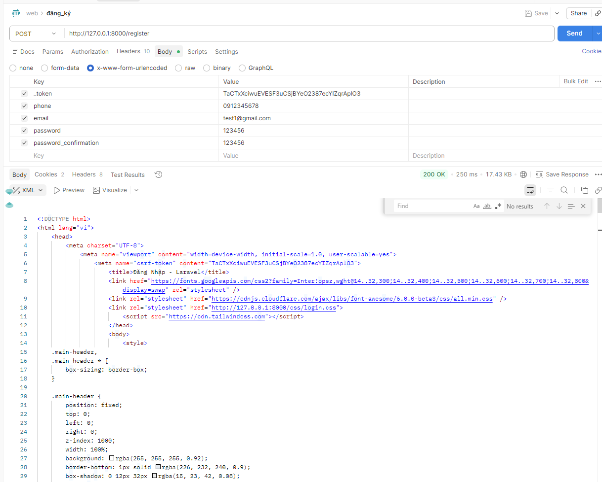
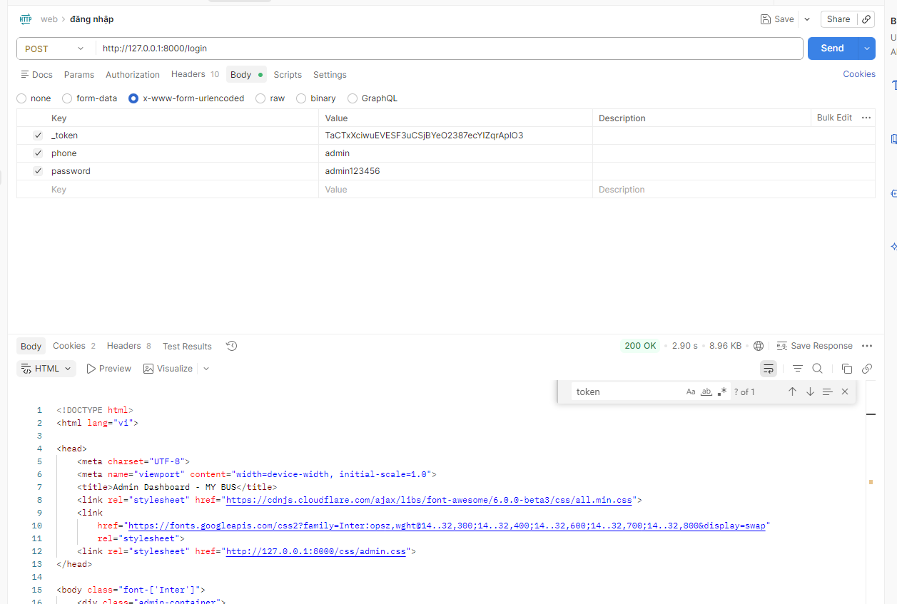
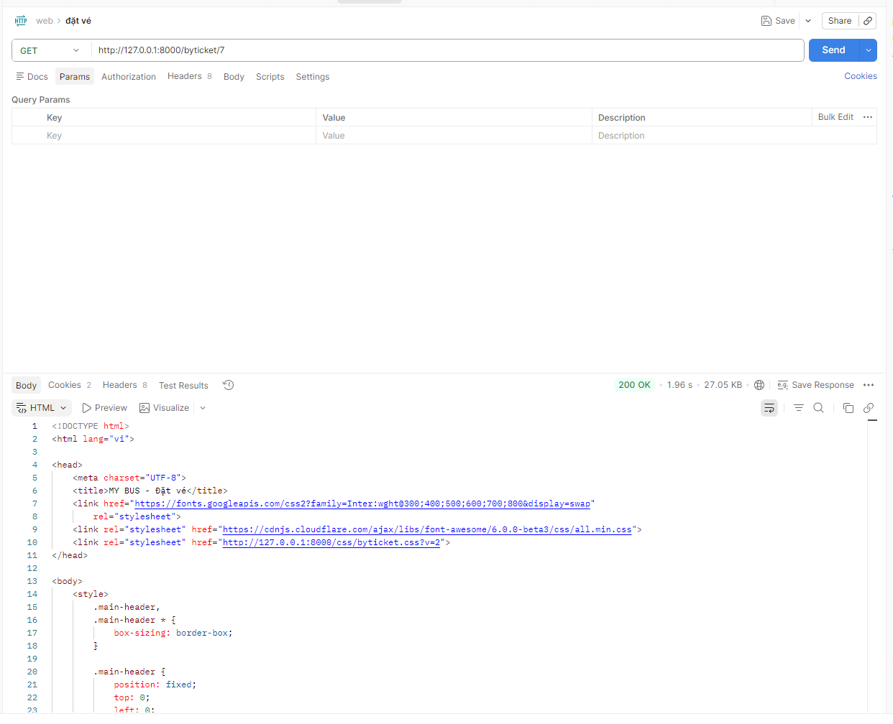
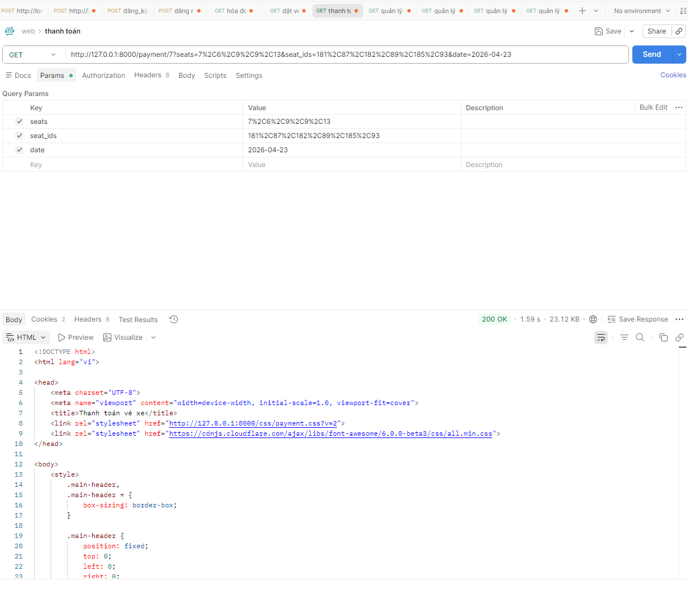
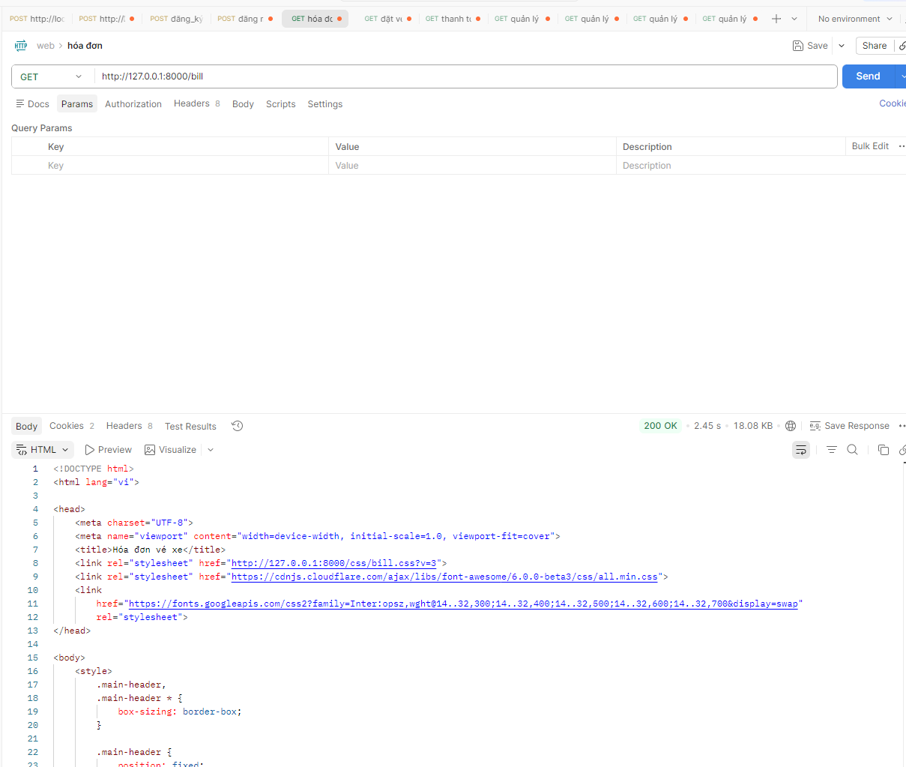
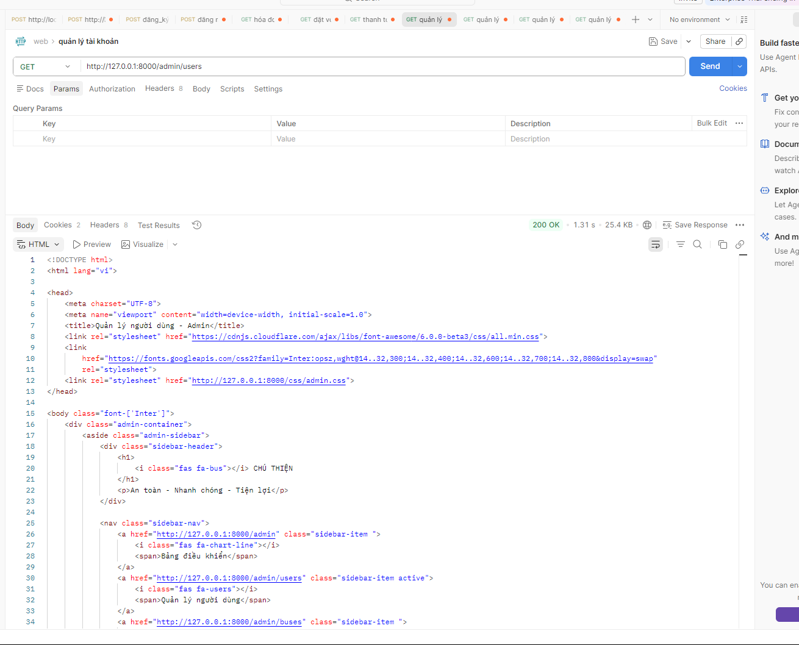
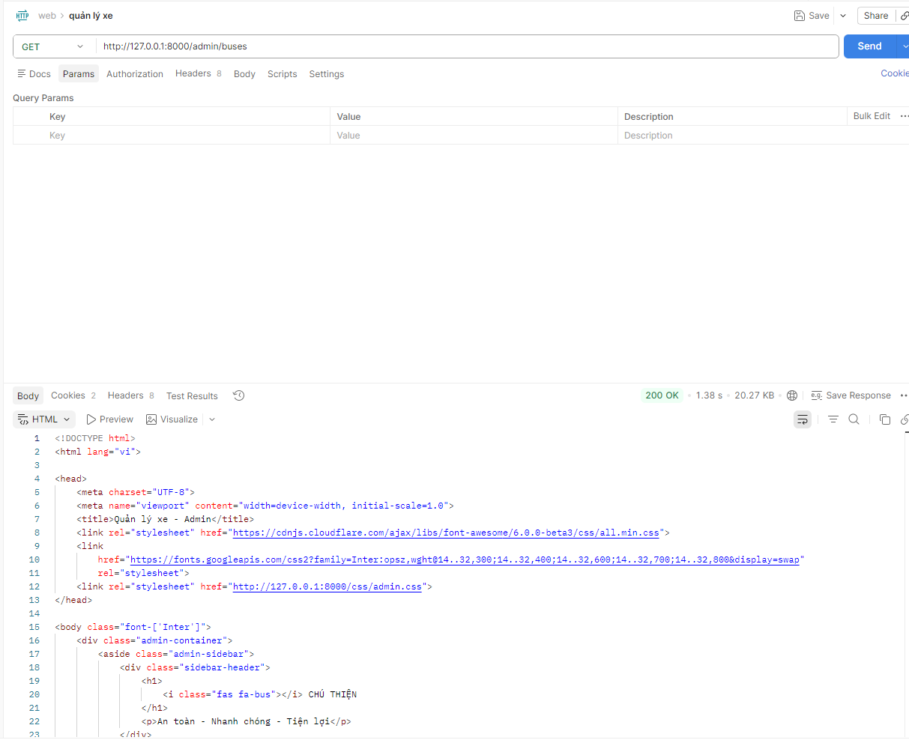
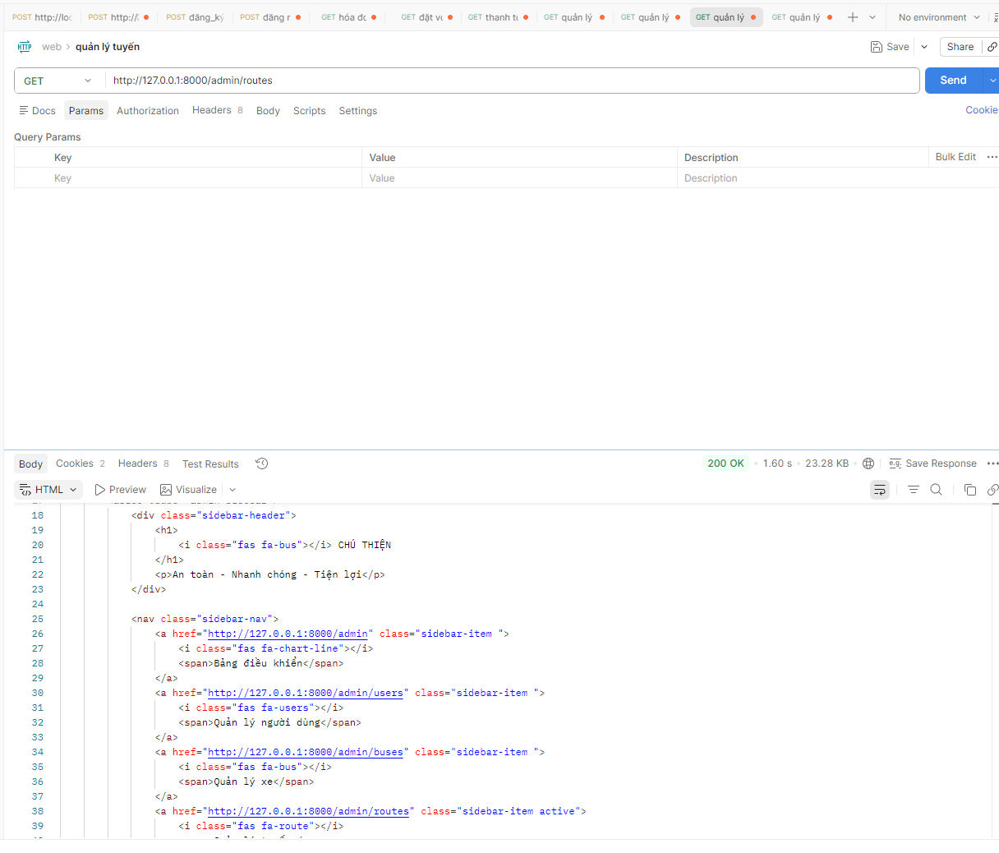
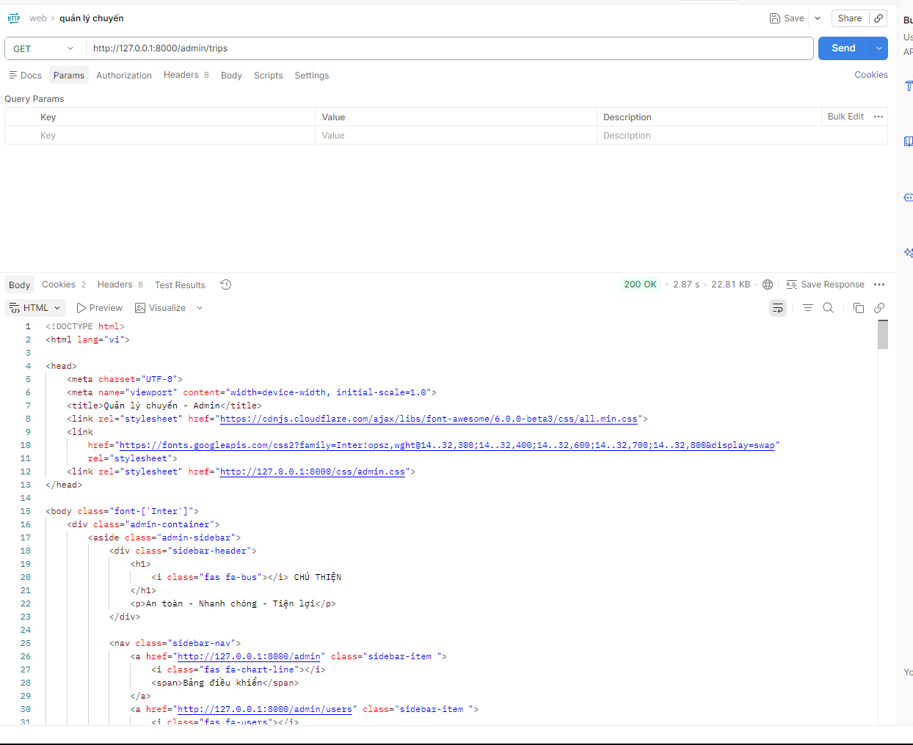

# DAILY REPORT - 03/04/2026

**Dự án:** Xây dựng website đặt vé xe  
**Nhóm:** Phạm Đình Luân, Trần Ngọc Thiện

---

## TỔNG HỢP TIẾN ĐỘ HÔM NAY 03/04/2026

| Thành viên | Chức năng phụ trách | Trạng thái | Ghi chú |
| :-- | :-- | :-- | :-- |
| Phạm Đình Luân | Thiết kế Database | Hoàn thành | Đã review và đồng bộ dữ liệu với hệ thống |
| Trần Ngọc Thiện | UI/UX Design | Hoàn thành | Đã hoàn thiện giao diện chính và các màn hình chức năng |

---

## SCREENSHOT VÀ GHI CHÚ TỪNG CHỨC NĂNG

### 1. Chức năng đăng ký

**Ghi chú chức năng:**
- Cho phép người dùng tạo tài khoản mới với thông tin cơ bản.
- Kiểm tra dữ liệu đầu vào trước khi gửi lên hệ thống.
- Là bước đầu để người dùng có thể sử dụng các chức năng đặt vé và xem hóa đơn.

### 2. Chức năng đăng nhập

**Ghi chú chức năng:**
- Xác thực người dùng bằng tài khoản đã đăng ký.
- Sau khi đăng nhập thành công, hệ thống lưu trạng thái phiên làm việc.
- Người dùng có thể tiếp tục đặt vé, thanh toán và theo dõi lịch sử giao dịch.

### 3. Chức năng đặt vé

**Ghi chú chức năng:**
- Hiển thị thông tin tuyến xe, ghế ngồi và giá vé.
- Cho phép người dùng chọn ghế còn trống theo chuyến.
- Dữ liệu ghế được dùng để chuyển sang bước thanh toán.

### 4. Chức năng thanh toán

**Ghi chú chức năng:**
- Xác nhận lại thông tin chuyến đi, ghế đã chọn và tổng tiền.
- Hỗ trợ hình thức thanh toán như tiền mặt hoặc chuyển khoản.
- Sau khi xác nhận, hệ thống lưu vé và cập nhật trạng thái ghế.

### 5. Chức năng hóa đơn

**Ghi chú chức năng:**
- Hiển thị danh sách vé hoặc hóa đơn mà người dùng đã đặt.
- Hỗ trợ theo dõi trạng thái thanh toán và thông tin chuyến đi.
- Giúp người dùng tra cứu lại lịch sử đặt vé nhanh chóng.

### 6. Chức năng quản lý tài khoản

**Ghi chú chức năng:**
- Dành cho quản trị viên theo dõi danh sách tài khoản trong hệ thống.
- Có thể kiểm tra thông tin người dùng và vai trò tương ứng.
- Là nền tảng để quản lý phân quyền và dữ liệu người dùng.

### 7. Chức năng quản lý xe

**Ghi chú chức năng:**
- Quản lý thông tin xe như biển số, loại xe, số ghế và trạng thái hoạt động.
- Hỗ trợ thêm, sửa và xóa dữ liệu xe trong hệ thống.
- Dữ liệu xe được liên kết với tuyến và chuyến xe.

### 8. Chức năng quản lý tuyến

**Ghi chú chức năng:**
- Quản lý các tuyến xe theo điểm đi, điểm đến và thời gian dự kiến.
- Cho phép cập nhật thông tin tuyến để phục vụ tìm kiếm và đặt vé.
- Tuyến xe là dữ liệu trung tâm để kết nối với xe và chuyến xe.

### 9. Chức năng quản lý chuyến

**Ghi chú chức năng:**
- Tạo và cập nhật các chuyến xe cụ thể theo từng tuyến.
- Quản lý ngày đi, giờ đi, xe phục vụ và số ghế còn trống.
- Giúp hệ thống vận hành đúng theo lịch trình thực tế.

---

## KẾT LUẬN

- Các giao diện chính của hệ thống đặt vé xe đã được hoàn thiện ở mức cơ bản.
- Báo cáo đã được cập nhật đầy đủ ảnh minh họa đúng theo từng chức năng hiện có.
- Mỗi chức năng đều đã được bổ sung ghi chú ngắn để thuận tiện cho việc trình bày và báo cáo tiến độ.
