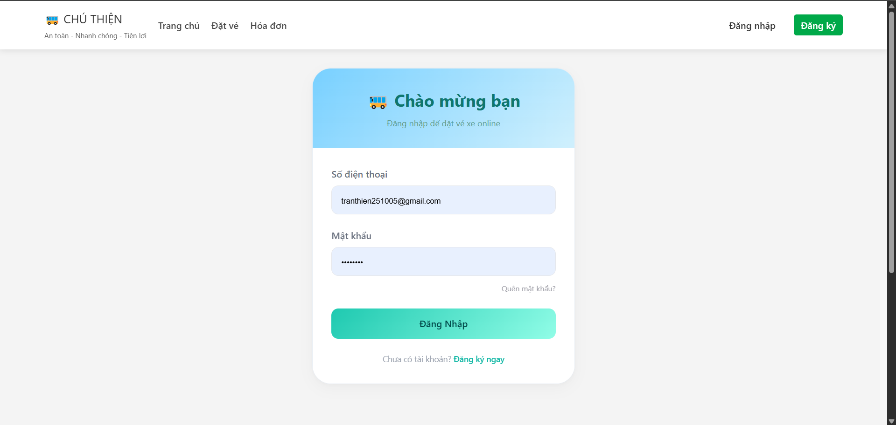
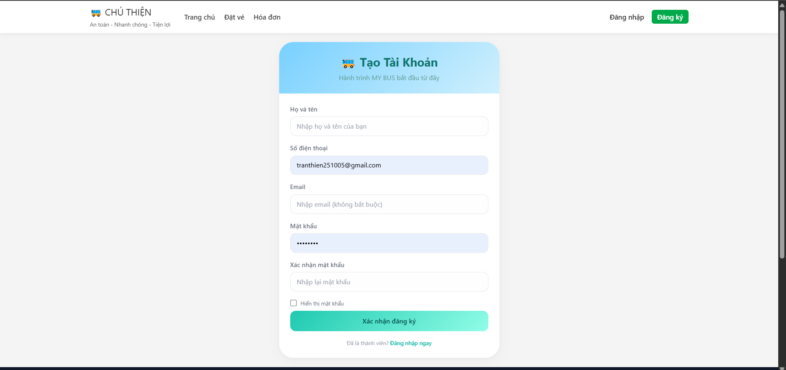
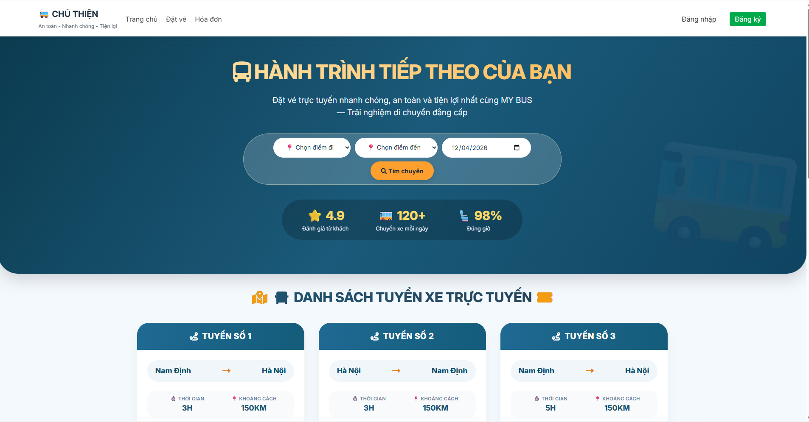
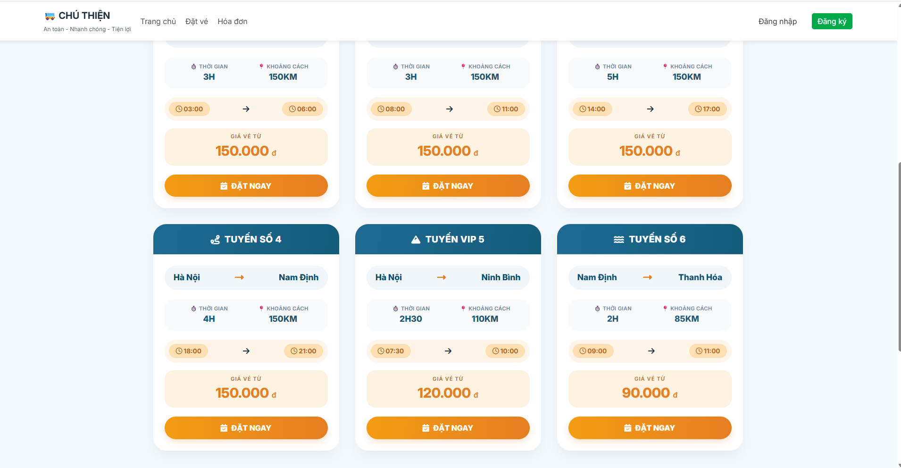
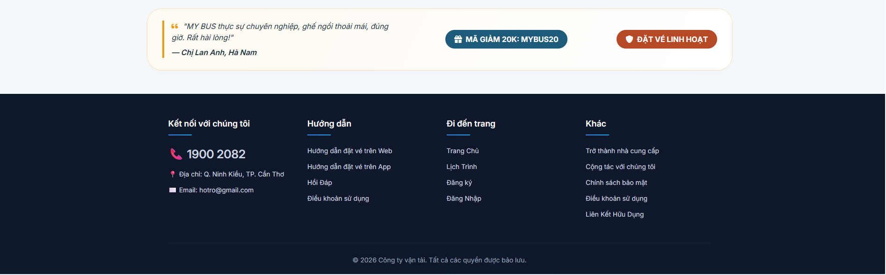
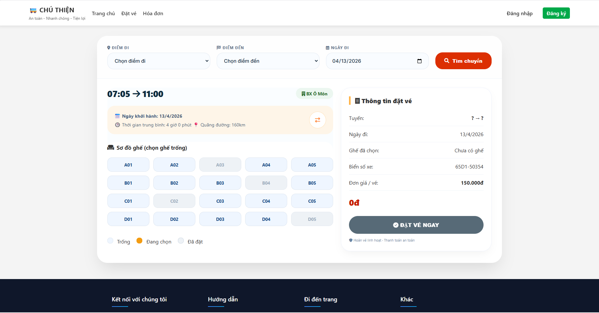

# DAILY REPORT - 03/04/2026

**Dự án:** Xây dựng website đặt vé xe
**Nhóm:** Phạm Đình Luân, Trần Ngọc Thiện

---

## TỔNG HỢP TIẾN ĐỘ HÔM NAY 03/04/2026

| Thành viên      | Chức năng phụ trách | Trạng thái    | Ghi chú                |
| :-------------- | :------------------ | :------------ | :--------------------- |
| Phạm Đình Luân  | Thiết kế Database   | ✅ Hoàn thành | Đã review với supabase |
| Trần Ngọc Thiện | UI/UX Design        | ✅ Hoàn thành | Đã push lên Figma      |

---

## SCREENSHOT

### Tính năng 1: [Chức năng đăng nhập]

### Tính năng 2: [Chức năng đăng ký]

### Tính năng 3: [Giao diện chính của trang web]

### Tính năng 4: [giao diện Chức năng đặt vé]

## 
